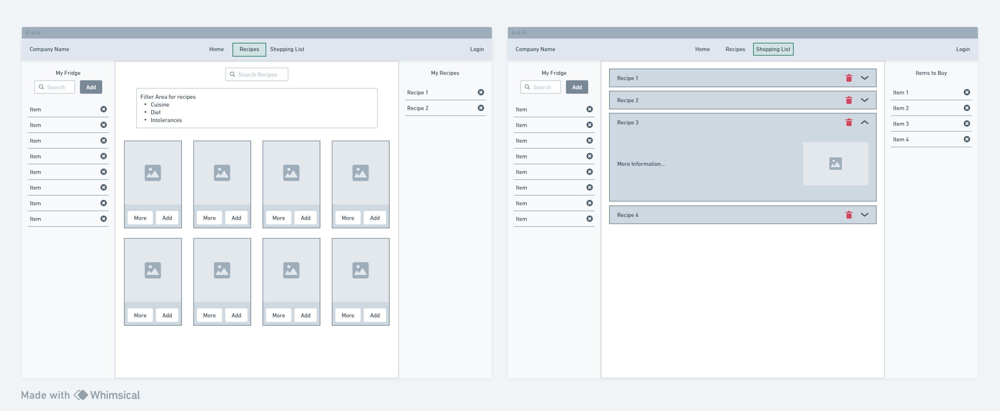

# Fridgefy

Welcome to Fridgefy!
It is a Next.js/React.js web app that allows you to store your recipes and ingredients that you have in a fridge.
Recipes can be filtered by ingredients, cuisine, diet, intolerance, and more.

> **Important Note:**
> You have the flexibility to replace the entire repository with a tech stack of your choice, such as React or Next.js. Feel free to set up your project as you see fit, but please keep this README.md file for your reference throughout the project. The requirements and guidelines outlined here should still be followed, regardless of your chosen stack.

> **Group Work:**
> Ideally, I would like for you to work as a team. If you don't have a team, you can work individually. I will give you a day to find a team and do let me know who you are and who are your team members. Maximum of 3 people per team.

## Dates

- Oct 07, 2024 - Project Kickoff
- Oct 15, 2024 - Project Presentation

## Features

### All users

- [ ] Search for recipes. You can find it in the API documentation of [DummyJSON](https://dummyjson.com/docs/recipes)

### Only registered users

- [ ] Add ingredients to the fridge
- [ ] Add recipes to the wish list
- [ ] Make shopping list based on selected recipes
- [ ] Search for recipes based on ingredients in the fridge. Add a checkbox in the filter area to show only recipes with ingredients in the fridge.

## Pages

- [ ] Home / Hero page
- [ ] All Recipes page with search and filters
- [ ] Wish list page with shopping list

## Bonus
These are some ideas for the bonus features. You can choose any of them to implement.

- [ ] Filter recipes by ingredients in the fridge
- [ ] Filter recipes by cuisine
- [ ] Filter recipes by meal type
- [ ] Filter recipes by tags
- [ ] Filter recipes by rating
- [ ] Filter recipes by review count
- [ ] Filter recipes by prep time
- [ ] Remove item from the shopping list if the ingredient was added to the fridge

## Demo Application
You may refer to the following demo application for the project.
Some of the features are implemented in the demo application. (CRUD operations, Authentication, and Authorization)

- [ReizApp](https://wad301-demo-denkireizouko.vercel.app/)

## API

- https://dummyjson.com/docs/recipes

## Database

Personalized fridge items and selected recipes can be stored using one of the following:

### Services
- [Firebase](https://firebase.google.com/docs/database/rtdb-vs-firestore)
- [Supabase](https://supabase.com/docs/guides/getting-started/quickstarts/nextjs)
- [Vercel Postgres](https://vercel.com/docs/storage/vercel-postgres/quickstart)
- [Neon](https://neon.tech/docs/guides/nextjs) (Francois' Recommendation)

### Stand-alone Databases
- [Prisma](https://www.prisma.io/nextjs) with your choice of database (e.g., PostgreSQL, MySQL)
- [MongoDB](https://www.mongodb.com/developer/languages/javascript/nextjs-with-mongodb/) with Mongoose

> **Info:** Choose the option that best fits your project needs and team's expertise. It is not necessary to use a service for the database. You can use a stand-alone database. Use the knowledge you have learned in the Node.js class.

## Authentication

- SSO with Google or Github
  > Choose from any authentication providers you prefer such as:
  - [Firebase Authentication](https://firebase.google.com/docs/auth)
  - [Supabase Authentication](https://supabase.com/docs/reference/javascript/supabase-auth-sign-in-with-oauth)
  - [Next Auth (Auth.js)](https://next-auth.js.org/)
  - [Clerk](https://clerk.com/docs/references/nextjs)

> **Info:** It is not necessary to use a third-party authentication service. You can implement your own authentication system using the knowledge you've gained from your Node.js class, such as using JSON Web Tokens (JWT) or session-based authentication.

#### Side note for implementing other providers (NextAuth - Auth.js)

- (Set up for Github Provider)[https://docs.github.com/en/apps/oauth-apps/building-oauth-apps/creating-an-oauth-app]
- (Set up for Google Provider (google docs))[https://support.google.com/cloud/answer/6158849?hl=en#zippy=%2Cauthorized-domains]

## Frontend

- Next JS or React JS
- Highly recommend to use Typescript (It would be a big plus for future)
- App Router (if Next.js is used)
- React Router (if Next.js is NOT used)
- Context API with/without useReducer (as necessary)
- Testing is not required

## Design Resources

- An initial wireframe is provided within the repository. It is just for you to reference, so you can come up with your own.

- You can refer to these sites for design and UI insipirations from:
  - [Dribbble](https://dribbble.com/)
  - [Wix](https://www.wix.com/blog/website-design-trends)
  - [Template monster](https://www.templatemonster.com/blog/website-design-trends/)

## Rules of GIT

- **Never code on main
- Create a branch and work on your task
- Create PR, do PR reviews, and approve the PR before merging to the main branch
- Main branch should not be broken at anytime
- Conflicts happens time to time. It's a part of development. You are not doing anything wrong. There are ways of minimizing conflicts but you can never get rid of them.

## Team Workflow

### Format

Best practices for Standup meetings: 5-10 minutes per day

<blockquote>
<h3>What did you do yesterday?</h3>
Eg. I worked on the login page and implemented the Google login using NextAuth. I also created the user model in the database and implemented the signup functionality. 
<h3>What are you going to do today?</h3>
Eg. I will start working on the signup page and implement the Github login using NextAuth.
<h3>Do you have any blockers?</h3>
Eg. I am stuck on the signup page and I am not sure how to implement the email verification.
</blockquote>

### Dividing Tasks

- Design
- Frontend
- APIs
- Consider of using Github issue or Project management apps like Trello
- Pair programming (Take turns)

### Understand your data

- What is the data?
- What data do you need?
- What types of data do you need?
- How to store the data?
- Create the data flow

eg. search recipes -> fetch recipes -> display recipes -> add to My recipes (click event) -> store my recipes -> fetch my recipes (or manage state separately) -> display updated my recipes

### Set up your environment

- One member of the team will accept the project material (clone the repository) and other two will join to the team (repository collaboration - add as a collaborator)
- One member of the team will create a slack channel where async discussion happening and invite the rest members plus include instructor in the channel.
- Create `.env` or `.env.local` (choose based on official documentation) file at the root of the project for the firebase project (or other BaaS), and add it to the `.gitignore` file (`.env config` in the code)
- **MAKE SURE YOU DON'T PUSH THE .ENV FILE TO GITHUB**
- Push the initial commit to the repository
- Every member should clone the repository
- Every member should create their own branch

### Create the design

- Think about the UI and how would you split into components
- Create the wireframe (lo-fi, hi-fi)
- The more design, the faster you can build in development phase.

### Please keep in mind!!

- if something fails in your team, it is not one of your team member's failure but `WHOLE TEAM`.
- if you do not want to lead, `follow` the lead
- Decide as a team
- Be responsive - no longer than half day
- Please flag if you think you are behind
- If you are stuck on a problem for more than 1 hour, It is time to ask for help
- Take an action instead of keep thinking

# Last note

Remember, while a fully working app is not the primary expectation, your effort and progress are highly valued. Here are some key points to keep in mind:

1. Focus on functionality first. Make the core features work before adding extra bells and whistles.
2. Don't spend too much time making it fancy. A working app with basic styling is better than a beautiful but non-functional one.
3. Prioritize implementing the main requirements before adding additional features.
4. Show your problem-solving skills and your ability to learn and apply new concepts.
5. Document your progress and challenges. This can be as valuable as the final product.
6. If you encounter difficulties, don't hesitate to ask for help or clarification.

Remember, the journey of building this project is just as important as the destination. Your effort, learning, and growth throughout this process are what truly matter. Good luck, and enjoy the process of bringing Fridgefy to life!
